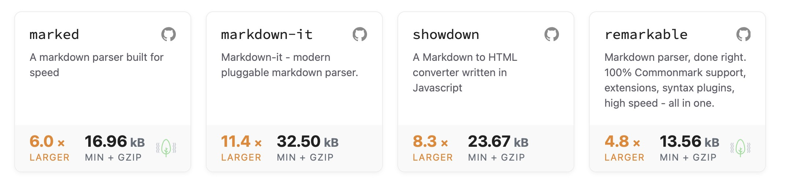

# Starkdown 🦾

<a href="https://www.npmjs.com/package/starkdown"></a>
<a href="https://www.npmjs.com/package/starkdown"></a>

Starkdown is a Tiny <4kb Markdown parser written, almost as fast and smart as Tony Stark.

```sh
npm i starkdown
```

## Motivation

It is a continuation on a similar package called [Snarkdown](https://github.com/developit/snarkdown), which had stopped development at 1kb, but doesn't include basic support for paragraphs, tables, fenced divs, etc.

Starkdown stays around 1.6kb and adds these additional enhancements:

- [Paragraphs](#paragraphs)
- [Tables](#tables)
- [Fenced Divs](#fenced-divs)
- [Escaping snake_case words](#escaping-snake_case-words)

Package size wise, compared to other Markdown parsers, it's **8 ~ 18 times smaller!** See the [Package Size Comparison Chart](#package-size-comparison-chart)

## Usage

Starkdown is really easy to use, a single function which parses a string of Markdown and returns a String of HTML. Couldn't be simpler.

```js
import { starkdown } from 'starkdown'

const str = '_This_ is **easy** to `use`.'

const html = starkdown(str)
```

The `html` returned will look like:

```html
<p><em>This</em> is <strong>easy</strong> to <code>use</code>.</p>
```

### Paragraphs

With most Markdown implementations, paragraphs are wrapped in `<p>` tags. With Starkdown, this is no different.

- All paragraphs and "inline" elements are wrapped in a `<p>` tags
  (See [List of "inline" elements](https://developer.mozilla.org/en-US/docs/Web/HTML/Inline_elements#list_of_inline_elements) on MDN)
  - Eg. a standalone image will still be wrapped in a `<p>` tag, because it's an inline element.
- All non-inline elements will not be wrapped in `<p>` tags
  - Eg. a table will not be wrapped in a `<p>` tag.

```md
Check [github](https://github.com)

Img: 
```

converts to

```html
<p>Check <a href="https://github.com">github</a></p>
<p>Img: </p>
```

But also, when _just_ using images and links:

```md
[github](https://github.com)


```

converts to

```html
<p><a href="https://github.com">github</a></p>
<p></p>
```

In contrast, non-inline elements won't get a `<p>` tag:

```md
### Code

\`\`\`js
const a = 1
\`\`\`
```

converts to

```html
<h3>Code</h3>
<pre class="code js"><code class="language-js">const a = 1</code></pre>
```

### Links

Usual markdown for links works, i.e

```md
[github](https://github.com)
```

becomes

```html
<p><a href="https://github.com">github</a></p>
```

But you can also add properties and classes to links using attribute lists like so:

```md
[github](https://github.com){:target="\_blank" .foo .bar #baz}
```

becomes

```html
<p><a href="https://github.com" target="_blank" class="foo bar" id="baz">github</a></p>
```

### Tables

```md
| My | Table |
```

converts to

```html
<table>
  <tr>
    <td>My</td>
    <td>Table</td>
  </tr>
</table>
```

### Fenced Divs

```md
:::
this is some info
:::
```

converts to

```html
<div class="fenced"><p>this is some info</p></div>
```

**Or with a custom class.**

```md
::: info
this is some info
:::
```

converts to

```html
<div class="fenced info"><p>this is some info</p></div>
```

### Escaping snake_case words

You need to escape your formatting with `\` in order to correctly convert sentences like these:

```md
snake*case is \_so-so*
```

will convert to:

```html
<p>snake<em>case is </em>so-so</p>
```

Instead you should write

```md
snake*case is \_so-so*
```

which will convert to:

```html
<p>snake_case is <em>so-so</em></p>
```

## Prevent certain MarkDown features

Starkdown comes built in with several "parsers" that each are responsible to convert a part of the markdown to HTML. You can filter out certain parsers to get different results.

The list of enabled default parsers can be inspected at [./src/defaultParsers.ts](./src/defaultParsers.ts).

```js
import { starkdown } from 'starkdown'
import { defaultParsers } from 'starkdown/es/defaultParsers'

const str = '_This_ is **easy** to `use`.'

// implicitly uses defaultParsers
const mdDefault = starkdown(str)

// this is a quick way to parse the string without the table tokeniser
// however, even though the parser is not used, it will not get tree-shaked
const mdNoTables = starkdown(str, { plugins: [defaultParsers.filter((x) => x.name !== 'table')] })
```

You can also add your own parsers this way. See [Custom Parsers](#custom-parsers) below.

## Tree-Shaking

You can slim down the import & bundle size of Starkdown if you don't need all of the parsers provided in Starkdown by default.

The list of default parsers can be inspected at [./src/defaultParsers.ts](./src/defaultParsers.ts).

```js
import { createTokenizerParser } from 'starkdown'
import {
  escape,
  boldItalicsStrikethrough,
  codeblocks,
  inlineCode,
  quote,
} from 'starkdown/es/parsers'

const str = '_This_ is **easy** to `use`.'

// This will tree-shake out any parser that is not used
const mdDiscordPlugins = [escape, boldItalicsStrikethrough, codeblock, inlineCode, quote]
const mdDiscord = starkdown(str, { plugins: mdDiscordPlugins })

// Note: These are in order of priority so the order can matter, e.g `escape` must come first to escape markdown
```

You can also add your own parsers this way. See [Custom Parsers](#custom-parsers) below.

## Custom Parsers

Parsers are defined as objects that match the following typescript definition

```ts
export type ParserDef = {
  // must be a unique name
  name: string
  // regex must contain at least 1 named capture group,. these are parsed to as the vars in the ParserFunction
  regex: RegExp
  handler: ParserFunction
}

export type ParserFunction = (
  // Capture groups are here
  vars: Record<string, string>,
  state: {
    // index of the token
    index: number
    // source string
    src: string
    // length of match
    length: number
    // index of the last char of match, (equal to index + length)
    lastIndex: number
    // for recursive parsing of tokens
    parseParagraph: (str: string) => string
    parseNext: (str: string, start: number) => ParseData
    parseIter: (str: string) => IterableIterator<ParseData>
    parse: (str: string) => string
  }
  // if a string is returned, it is transformed into parseData using the index and lastIndex in state
) => string | ParseData

export type ParseData = [
  result: string | string[],
  // Start index of match
  startIndex: number,
  // end index of match, this is useful if your end up parsing more than
  // the tokeniser originally provided
  stopIndex: number,
  // any data you wish to forward can be included here for later parsers to use
  data?: Record<string | symbol, unknown>
]
```

Examples can be found in the [parsers folder](./src/parsers/).

## Security

**Note on XSS:** Starkdown doesn't sanitize HTML. Please bring your own HTML sanitation for any place where user input will be converted into HTML.

## Package Size Comparison Chart


